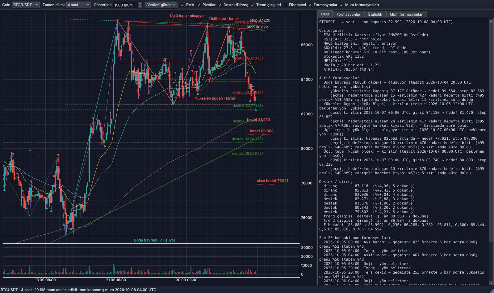

# Grafik Analiz

BTC, ETH ve SOL için grafik analizi yapan ve fiyat hareketini tahmin etmeye
çalışan masaüstü uygulaması ve Python kütüphanesi.

Proje aşamalarla geliştiriliyor. Bu sürüm **1. aşamadır**: veri, göstergeler
ve kural tabanlı grafik analizi (formasyonlar, hedefleri ve geçmiş başarı
oranları) ile masaüstü uygulaması.



## Neler var

- **Veri:** Binance spot mumları. 5 dakika, 15 dakika, 1 saat, 4 saat ve
  günlük. Geçmiş, resmî aylık arşivden SHA256 doğrulamasıyla iner; son
  günler REST API'den tamamlanır. Veri bilgisayarda saklanır, sonraki
  güncellemeler yalnız eksik kısmı indirir.
- **Göstergeler:** EMA 20/50/200, RSI, MACD, Bollinger, stokastik, ADX/DI,
  ATR, OBV, CCI, MFI, VWAP, Donchian.
- **Pivotlar:** ATR eşikli zigzag ile tepe ve dipler (iki ölçek: 2 ve 4 ATR).
- **Destek/direnç, trend çizgileri, Fibonacci düzeltmeleri.**
- **16 grafik formasyonu:** ikili tepe/dip, üçlü tepe/dip, omuz-baş-omuz ve
  tersi, yükselen/alçalan/simetrik üçgen, yükselen/alçalan kama,
  dikdörtgen, boğa/ayı bayrağı, fincan-kulp ve tersi. Her formasyon için
  kırılım tetiği, hedef fiyatı ve stop seviyesi.
- **22 mum formasyonu:** doji (3 çeşit), topaç, çekiç, asılı adam, ters
  çekiç, kayan yıldız, yutan boğa/ayı, harami, delen mum, kara bulut,
  sabah/akşam yıldızı, üç beyaz asker, üç kara karga, marubozu, cımbız
  tepe/dip.
- **Geçmiş istatistikler:** her formasyon tipinin aynı coin ve zaman
  dilimindeki geçmiş sonuçları ve rastgele hareket kıyası.
- **Masaüstü uygulaması:** mum grafiği, hacim, bütün katmanlar,
  formasyon/istatistik tabloları; bir formasyona tıklayınca grafik oraya
  gider ve hedef/stop çizgilerini gösterir.

## Kurulum (Windows)

[Python 3.12](https://www.python.org/downloads/) kurulu olmalı. Depo
klasöründe `baslat.bat` dosyasına çift tıklamak yeterli: ilk açılışta sanal
ortamı kurar, paketleri yükler ve uygulamayı başlatır.

Elle kurmak için PowerShell'de, depo klasöründe:

```powershell
py -3.12 -m venv .venv
.\.venv\Scripts\python.exe -m pip install -r requirements.txt
.\.venv\Scripts\python.exe -m grafik_analiz uygulama
```

Veri `C:\Users\<kullanıcı>\GrafikAnaliz\veri` klasörüne kaydedilir
(`GRAFIK_ANALIZ_VERI` ortam değişkeniyle değiştirilebilir). İlk indirme
coin/zaman dilimi başına birkaç saniye ile yarım dakika arası sürer.

## Kullanım

### Uygulama

Üst çubuktan coin ve zaman dilimi seçilir; seçim değişince veri güncellenir
ve analiz yeniden çalışır. Onay kutuları grafik katmanlarını açıp kapatır.

| Sekme | İçerik |
|---|---|
| Özet | Göstergeler, aktif formasyonlar (tetik, hedef, stop, geçmiş oran), seviyeler, son mum formasyonları |
| Formasyonlar | Aktif / sonuçlanan / bütün formasyonlar. Satıra tıklayınca grafik formasyona gider |
| İstatistik | Formasyon tiplerinin geçmiş hedef payı ve kıyası; mum formasyonlarının isabeti ve taban oranı |
| Mum formasyonları | Son 300 bardaki mum formasyonları |

Grafikte fare tekerleği yakınlaştırır, sürükleme kaydırır; dikey ölçek
görünen mumlara göre kendini ayarlar.

### Komut satırı

```powershell
python -m grafik_analiz guncelle                       # bütün coin ve zaman dilimleri
python -m grafik_analiz guncelle --coin BTC --dilim 4h 1d
python -m grafik_analiz analiz --coin ETH --dilim 4h   # son durumun özeti
python -m grafik_analiz istatistik --coin SOL --dilim 1h
```

## Nasıl çalışıyor

### Formasyon tespiti

1. Zigzag, fiyat son uç noktadan `eşik × ATR` kadar geri döndüğünde o uç
   noktayı tepe/dip olarak kesinleştirir. Her pivot, kesinleştiği barla
   birlikte saklanır.
2. Her yeni pivot kesinleştiğinde son 3–6 pivotun dizilişi formasyon
   kurallarıyla karşılaştırılır. Toleranslar ATR'ye ve formasyon
   yüksekliğine göre ölçeklenir; aynı kurallar her coin ve zaman diliminde
   çalışır.
3. Formasyon **oluşuyor** durumundadır. Kapanış sınır çizgisini (boyun
   çizgisi, üçgen kenarı, bayrak üst çizgisi…) geçince **kırılım** olur.
   Giriş o barın kapanışıdır.
4. **Hedef:** klasik ölçülen hareket — kırılım noktasından formasyon
   yüksekliği kadar (kamalarda kamanın başladığı seviye). **Stop:**
   formasyonu geçersiz kılan seviye (ör. ikili tepede tepeler, omuz-baş-
   omuzda sağ omuz, üçgende karşı kenar).
5. Kırılımdan sonra fiyatın önce hedefe mi stopa mı ulaştığı izlenir.
   Formasyon genişliğinin iki katı süre içinde ikisi de olmazsa **süre
   doldu** sayılır. Aynı barda ikisi birden görülürse sıra bilinmediği için
   stop sayılır.

Kırılım gelmeden süre dolarsa **kırılımsız**, ters yöne kırılırsa
**geçersiz**, aynı pivotlarla daha büyük bir formasyona dönüşürse (ör. ikili
tepe → üçlü tepe) **dönüştü** olur.

### İstatistikler ve kıyas

**Hedef payı** = hedef / (hedef + stop): kırılımdan sonra hedef ya da
stoptan birine ulaşanlar içinde hedefin payı. Süresi dolanlar ayrı sayılır.

**Rastgele hareket kıyası** = S / (H + S). H girişten hedefe, S girişten stopa
uzaklıktır. Yönü olmayan bir fiyat, hedef ile stoptan birine ulaştığında bu
olasılıkla önce hedefe ulaşır. Formasyonun hedef payı bu değerin üzerindeyse
formasyon hedef/stop mesafelerinin kendiliğinden getireceğinden fazlasını
sağlıyor demektir. Uygulamada hedef payı, %95 güven aralığı kıyası tamamen
dışarıda bırakıyorsa yeşil (üstünde) veya kırmızı (altında) gösterilir.

Mum formasyonlarında **isabet**, formasyondan 6 bar sonra fiyatın beklenen
yönde olma oranıdır; **taban**, aynı dönemde koşulsuz orandır.

### İleri bakış (lookahead) güvencesi

Analiz tamamen nedenseldir; testler bunu denetler: seri herhangi bir barda
kesilip yeniden analiz edildiğinde o bara kadar bilinen pivotlar,
formasyonlar, durumları, hedef/stopları ve istatistikler bit bit aynı
kalmalıdır (`tests/test_patterns.py::test_no_lookahead_*`). Özellikle:

- Pivot, ancak ters hareket eşiği geçtiğinde kullanılır.
- Formasyon, son pivotu kesinleştiği barda bilinir; kırılım o bardan önce
  aranmaz. Fiyat tespit anında hareketin yarısını çoktan yapmışsa formasyon
  kaydedilmez.
- İki ölçekte aynı yapı bulunursa **önce tespit edilen** tutulur; sonradan
  gelen bir bilgiyle geçmiş seçilmez.
- İstatistikler yalnızca sonucu o ana kadar belli olmuş formasyonlarla
  hesaplanır.

## Gerçek veride ilk ölçüm

8 Ekim 2026'ya kadarki veriyle, 3 coin × 5 zaman diliminde hedef ya da
stopa ulaşan **28.175 kırılım** (5 dakikalıkta son 150.000 mum):

- Toplam hedef payı **%40,4**, rastgele hareket kıyası **%40,4**.
- 22 formasyon/yön grubunun 17'sinde fark istatistiksel olarak anlamlı
  değil (%95 aralık kıyası içeriyor). 2 grup kıyasın üstünde (üçlü dip
  %65,2 / %60,4; ikili tepe %63,2 / %60,1), 3 grup altında (ayı bayrağı,
  boğa bayrağı, aşağı kırılan yükselen üçgen).
- Kırılımların %17,6'sında süre hedef ya da stop görülmeden doldu.

Bu rakamlar `python -m grafik_analiz istatistik` ile her coin ve zaman dilimi
için ayrı ayrı yeniden üretilebilir.

## Yol haritası

| Aşama | İçerik | Durum |
|---|---|---|
| 1 | Veri, göstergeler, kural tabanlı grafik analizi, formasyon hedefleri, masaüstü uygulaması | bu sürüm |
| 2 | Makine öğrenmesi: yön olasılığı, hedef/stop olasılığı, fiyat aralığı (kantil) tahmini; yürüyen (walk-forward) değerlendirme | sırada |
| 3 | Derin öğrenme (LSTM / Transformer) | |
| 4 | Grafik görüntüsünden formasyon tanıma (CNN / YOLO) | |
| 5 | İleriye dönük kayıt: tahminleri önce kaydet, sonra puanla | |

## Dosya yapısı

```
grafik_analiz/
  config.py            coinler, zaman dilimleri, veri klasörü
  data/binance.py      aylık arşiv + REST (adres yedekli)
  data/store.py        yerel önbellek, artımlı güncelleme
  indicators.py        göstergeler
  pivots.py            ATR zigzag
  levels.py            destek/direnç, trend çizgileri, Fibonacci
  patterns/base.py     formasyon kaydı, kırılım ve sonuç takibi
  patterns/chart.py    grafik formasyonları
  patterns/candles.py  mum formasyonları
  stats.py             geçmiş istatistikler, kıyaslar
  analysis.py          bütün analizi çalıştırır
  report.py            okunur özet metni
  cli.py               komut satırı
  app/                 masaüstü uygulaması (PySide6 + pyqtgraph)
tests/                 testler (sentetik formasyonlar, ileri bakış, veri, uygulama)
```

## Testler

```powershell
.\.venv\Scripts\python.exe -m pip install pytest
.\.venv\Scripts\python.exe -m pytest tests -q
```
